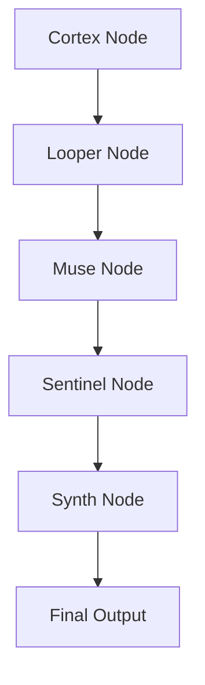
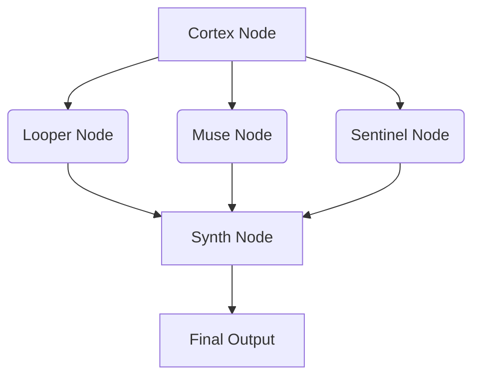
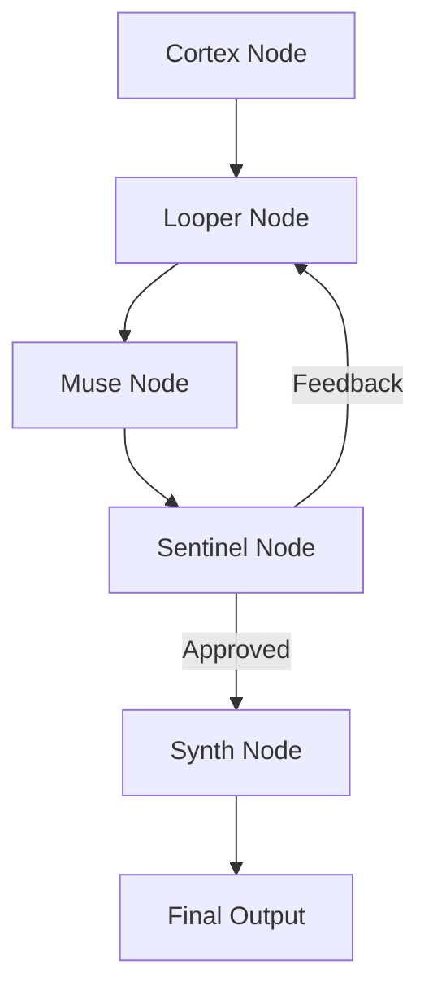
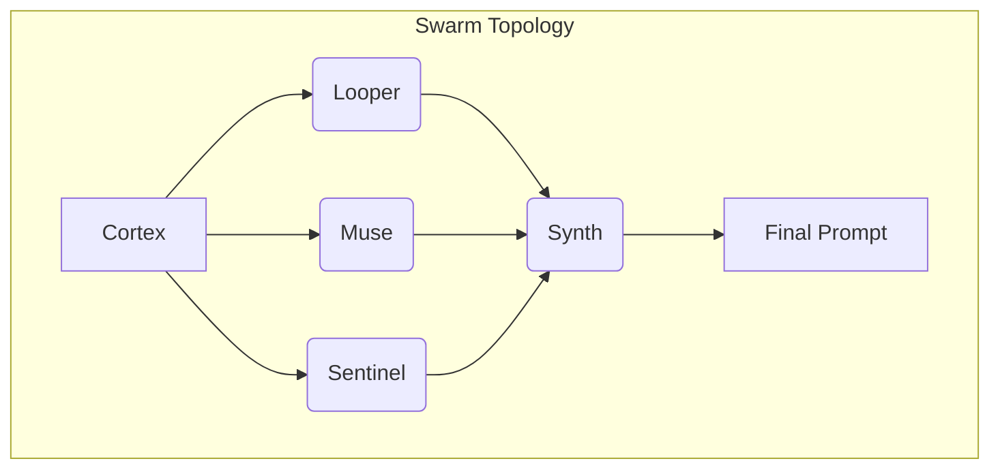

# SWARMFRAME Documentation

## 1. Introduction

SWARMFRAME is a novel, decentralized prompt collaboration engine designed to orchestrate multiple specialized AI prompt agents. It represents a paradigm shift from traditional single-prompt interactions to a dynamic, cooperative multi-agent system. Inspired by multi-agent LLM architectures, SWARMFRAME executes at the instructional level, allowing for a living network of prompts that can reason, branch, mutate, and merge.

This system empowers users to go beyond static prompts, enabling the creation of complex, adaptive, and highly nuanced AI interactions. By distributing cognitive roles among various nodes, SWARMFRAME enhances the quality, creativity, and coherence of generated outputs, making it ideal for intricate content generation, strategic planning, and iterative design processes.

## 2. Core Concepts

At its heart, SWARMFRAME operates on a few fundamental principles:

### 2.1. Prompt Swarm

A prompt swarm is a collective of intelligent, interlinked prompts, each functioning as an autonomous agent. These agents are characterized by:

- **Specialized Cognitive Roles**: Each agent is assigned a unique function (e.g., planning, evaluation, creativity, iteration, synthesis), allowing for a division of labor and specialized expertise within the swarm.

- **Persona DNA Awareness**: Agents are imbued with an awareness of a shared 'persona DNA,' which influences their behavior and output. This persona DNA is often anchored to biological system metaphors, providing a consistent and intuitive framework for understanding agent behavior.

- **Inter-Agent Communication**: Agents are designed to consume, mutate, or influence the outputs of their sibling prompts. This interconnectedness fosters a collaborative environment where information flows dynamically between specialized units.

- **Shared Intent Governance**: The entire swarm is governed by a central `Signal Bus`, which carries shared intent, constraints, and tone. This ensures that despite their autonomy, all agents work towards a common goal, adapting to each other's outputs and maintaining overall coherence.

### 2.2. The Signal Bus

The `Signal Bus` serves as the central nervous system of the SWARMFRAME, acting as a real-time, shared memory and communication channel for all agents. It is a dynamic data structure that encapsulates the current state of the task, the collective intent, and the historical progression of the swarm. The Signal Bus ensures that all agents have access to the most up-to-date information and can react to changes in the swarm's state.

Key components of the Signal Bus include:

- **`goal`**: The overarching objective of the current task (e.g., "Design a prompt that guides an AI to write a strategic brand manifesto").

- **`tone`**: The desired emotional or stylistic direction for the final output (e.g., "visionary, concise, culturally aware").

- **`constraints`**: A list of limitations or specific requirements that all agents must adhere to (e.g., "max 150 words", "must include metaphor").

- **`targetOutput`**: The expected format or type of the final deliverable (e.g., "launch-ready manifesto prompt").

- **`personaState`**: An object detailing the current persona configuration, including `persona_dna` (mapping of persona roles to biological system anchors) and `current_persona` (the active persona influencing the swarm).

- **`goalProgress`**: A numerical value (0-1) indicating the completion percentage of the task.

- **`outputHistory`**: A chronological record of successful outputs from various nodes, along with their scores and timestamps. This serves as a learning mechanism and a reference for the swarm's progression.

- **`rejectedPaths`**: A log of failed attempts or dead-ends, providing valuable insights for avoiding similar mistakes in future iterations.

- **`activeNodes`**: A list of agent nodes currently executing or actively participating in the swarm.

- **`nodeOutputs`**: A dictionary storing the latest output from each node, keyed by the node's name. This allows agents to easily access and build upon the work of others.

- **`signalChange`**: A string indicating the most recent significant change in the Signal Bus, which can trigger relevant agents to react or re-evaluate their actions.

### 2.3. Prompt Swarm Topology: Node Types and Responsibilities

SWARMFRAME defines a set of specialized nodes, each with a distinct cognitive role and a corresponding persona system anchor. This modular design allows for a clear division of labor and optimized processing of complex prompt generation tasks.

#### 🧠 Cortex Node (Master Planner)

- **Persona Anchor**: Skeletal + Nervous Systems
- **Function**: The Cortex Node acts as the strategic brain of the swarm. Its primary responsibility is to interpret the high-level goal, decompose it into manageable sub-tasks, and map out the dependencies between these tasks. It sets the overall direction and orchestrates the activation sequence of other nodes.
- **Input**: Initial goal and constraints from the Signal Bus.
- **Output**: A detailed task breakdown, an execution sequence, and activation signals for other nodes, which are then updated in the Signal Bus's `nodeOutputs`.
- **Behavior**: Analytical, structured, and forward-thinking, ensuring that the swarm's efforts are aligned with the ultimate objective.

#### 🔍 Sentinel Node (Quality Guardian)

- **Persona Anchor**: Immune + Muscular Systems
- **Function**: The Sentinel Node is responsible for evaluating the quality, clarity, coherence, and logical consistency of outputs generated by other nodes. It acts as a critical filter, ensuring that the swarm's output meets predefined standards and aligns with the overall intent.
- **Input**: Outputs from other nodes, along with quality criteria and constraints from the Signal Bus.
- **Output**: Scores, detailed feedback, and improvement suggestions. It can also flag outputs for rejection or suggest counterbalances if they deviate from the desired quality or tone.
- **Behavior**: Critical, protective, and standards-focused, safeguarding the integrity and effectiveness of the generated prompts.

#### 🎨 Muse Node (Creative Catalyst)

- **Persona Anchor**: Endocrine + Digestive Systems
- **Function**: The Muse Node injects creativity, narrative elements, emotional texture, and metaphorical depth into the prompts. It is responsible for transforming structured content into engaging and imaginative language.
- **Input**: Structured content or prompt fragments from other nodes (e.g., task components from Cortex, variants from Looper).
- **Output**: Enhanced prompts with rich metaphors, storytelling techniques, and sensory language, updated in the Signal Bus's `nodeOutputs`.
- **Behavior**: Imaginative, expressive, and emotionally intelligent, adding the 'spark' that makes prompts compelling.

#### 🔄 Looper Node (Variant Generator)

- **Persona Anchor**: Nervous + Cardiovascular Systems
- **Function**: The Looper Node is designed for iterative exploration. It takes existing prompts or concepts and generates multiple stylistic variants, alternative approaches, or experimental versions. This node is crucial for exploring the solution space and preventing the swarm from getting stuck in local optima.
- **Input**: Base prompts or core concepts, typically from the Cortex Node or previous iterations.
- **Output**: A collection of mutated or varied prompt versions, which are then made available in the Signal Bus's `nodeOutputs`.
- **Behavior**: Exploratory, adaptive, and experimental, constantly seeking new angles and possibilities.

#### 🔗 Synth Node (Integration Specialist)

- **Persona Anchor**: Respiratory + Skeletal Systems
- **Function**: The Synth Node is the final assembly point. It merges and synthesizes outputs from various other nodes into a cohesive, unified, and polished final prompt. It ensures that all contributing elements are seamlessly integrated into a single, effective output.
- **Input**: Diverse outputs from multiple nodes (e.g., task map from Cortex, creative enhancements from Muse, evaluated variants from Sentinel and Looper).
- **Output**: The final, ready-to-use prompt, which is the primary deliverable of the SWARMFRAME system.
- **Behavior**: Harmonizing, synthesizing, and balancing, ensuring a coherent and impactful final product.

#### 🧪 Critic Node (Adversarial Tester) [Optional]

- **Persona Anchor**: Immune + Nervous Systems
- **Function**: The Critic Node provides an adversarial perspective, running recursive counterfactuals and stress tests against proposed outputs. It identifies potential weaknesses, biases, or vulnerabilities in the generated prompts.
- **Input**: Proposed final outputs or critical intermediate results.
- **Output**: Vulnerability reports, edge case scenarios, and robustness scores, which can feed back into the swarm for further refinement.
- **Behavior**: Skeptical, thorough, and adversarial, pushing the boundaries of the prompt's resilience.

## 3. SWARM EXECUTION FLOW

SWARMFRAME supports flexible execution patterns, allowing for various levels of agent interaction and control. The choice of flow depends on the complexity of the task and the desired level of iteration and feedback.

### 3.1. Sequential Flow (Linear Pipeline)

In a sequential flow, agents execute in a predefined order, with the output of one agent serving as the input for the next. This is the simplest form of execution, suitable for straightforward tasks.

### 3.2. Parallel Flow (Concurrent Processing)

For tasks where multiple agents can work independently on different aspects of the problem, a parallel flow can significantly speed up processing. Outputs are then merged at a later stage.

### 3.3. Iterative Flow (Feedback Loops)

Iterative flows incorporate feedback loops, allowing agents to refine their outputs based on evaluations from other nodes. This is crucial for achieving high-quality results and adapting to complex requirements.

### 3.4. Swarm Flow (Dynamic Collaboration)

The most advanced execution pattern, the Swarm Flow, involves agents continuously monitoring the Signal Bus and activating themselves based on changes in the swarm's state. This enables highly dynamic and adaptive collaboration.

Agents act when:
- Triggered directly by other nodes.
- A significant change event occurs on the Signal Bus (e.g., Muse updated the tone).
- Their internal constraints are violated (e.g., Sentinel detects a loss of coherence).

## 4. SIGNALING & MEMORY PROTOCOL

Every prompt agent in the SWARMFRAME system interacts with the Signal Bus, both reading from and writing to it. This continuous interaction forms the backbone of the swarm's communication and collective memory.

### 4.1. Signal Bus Contents

The Signal Bus stores critical information that guides the swarm's operation:

- **`personaState`**: Captures the current behavioral biases and stylistic preferences of the swarm, influenced by the active persona and its associated DNA.
- **`goalProgress`**: Tracks the overall advancement of the task, allowing agents to understand the current stage of completion.
- **`outputHistory`**: A comprehensive record of all successful outputs generated by individual nodes, along with their associated quality scores. This serves as a valuable learning resource and a reference for past successful strategies.
- **`rejectedPaths`**: A log of dead-ends or unsuccessful attempts, providing insights into what approaches to avoid in the future. This contributes to the swarm's adaptive learning capabilities.

### 4.2. Node Activation Signals

To facilitate dynamic interaction, specific signals are used to trigger agent actions:

- **`INIT`**: Initiates processing for a node with a given set of parameters.
- **`PROCESS`**: Instructs a node to continue processing with updated inputs.
- **`REVIEW`**: Prompts a node (typically Sentinel or Critic) to evaluate and provide feedback on an output.
- **`MERGE`**: Signals the Synth Node to combine outputs from various sources.
- **`ITERATE`**: Triggers the Looper Node to generate variations or refine an existing output.
- **`FINALIZE`**: Indicates that a node has completed its contribution and is ready for final output or integration.

### 4.3. Message Types

Communication between agents and the Signal Bus is facilitated through distinct message types:

- **`DATA`**: Carries the actual content or information to be processed by a node.
- **`FEEDBACK`**: Contains quality scores, evaluation results, and suggestions for improvement.
- **`CONSTRAINT`**: Introduces new limitations or modifies existing requirements for the task.
- **`PERSONA_UPDATE`**: Notifies agents of changes to the overall persona state, influencing their behavioral biases.
- **`COMPLETION`**: A notification indicating that a specific task or sub-task has been completed by a node.

## 5. PERSONA SYSTEM INTEGRATION

The Persona System is a unique aspect of SWARMFRAME, integrating biological system metaphors to define and influence the behavior of each node. This provides an intuitive framework for understanding and tuning the swarm's collective intelligence.

Each node's `persona_dna` is mapped to specific biological systems, which guide its cognitive function and output style:

- **Skeletal System**: Represents structure, framework, and foundational elements. Nodes anchored to this system focus on organizing and providing a solid base for the prompt.
- **Nervous System**: Embodies communication, coordination, and responsiveness. Nodes with this anchor excel at information flow and dynamic reactions.
- **Immune System**: Signifies protection, filtering, and quality control. These nodes are adept at identifying and rectifying errors or inconsistencies.
- **Muscular System**: Represents action, execution, and strength. Nodes with this anchor are focused on robust and impactful output generation.
- **Endocrine System**: Influences mood, tone, and emotional regulation. Nodes linked here specialize in injecting appropriate emotional texture and stylistic nuances.
- **Digestive System**: Symbolizes processing, transformation, and absorption. These nodes are skilled at breaking down complex inputs and synthesizing them into digestible forms.
- **Cardiovascular System**: Represents flow, circulation, and energy distribution. Nodes with this anchor ensure smooth progression and efficient resource utilization within the swarm.
- **Respiratory System**: Embodies balance, rhythm, and life force. These nodes contribute to the overall coherence and vitality of the generated prompts.

## 6. QUALITY METRICS AND SCORING

To ensure the high quality of generated prompts, SWARMFRAME employs a comprehensive set of metrics for evaluating outputs. The Sentinel Node, in particular, leverages these metrics to provide objective feedback and guide the swarm towards optimal results.

Each output is evaluated on the following criteria:

- **Clarity**: How understandable, unambiguous, and well-structured the prompt is. A clear prompt leaves no room for misinterpretation by the AI.
- **Coherence**: The internal consistency and logical flow of the prompt. All parts of the prompt should align and contribute to a unified message.
- **Creativity**: The originality, innovativeness, and imaginative elements present in the prompt. This metric assesses the prompt's ability to inspire novel and engaging AI responses.
- **Alignment**: The degree to which the prompt matches the original goals, constraints, and desired persona. This ensures the output remains on target.
- **Completeness**: The coverage of all required elements and instructions within the prompt. A complete prompt provides all necessary information for the AI to perform its task effectively.
- **Effectiveness**: The likely success of the prompt in achieving its intended outcome. This is a predictive metric, assessing the prompt's potential to elicit the desired AI behavior or output.

## 7. MEMORY AND LEARNING

SWARMFRAME is designed with rudimentary memory and learning capabilities, allowing the system to adapt and improve over time. This is primarily facilitated through the `outputHistory` and `rejectedPaths` stored in the Signal Bus, which serve as a collective knowledge base for the swarm.

The system maintains and learns from:

- **Pattern Recognition**: By analyzing successful prompt structures and agent interactions recorded in `outputHistory`, the swarm can identify and reinforce effective patterns for future tasks.
- **Failure Analysis**: The `rejectedPaths` log provides critical insights into what approaches or combinations of agents lead to undesirable outcomes. This helps the swarm avoid repeating past mistakes.
- **Persona Evolution**: Over time, the system can observe how different `personaState` configurations affect the quality and style of outputs, allowing for refinement of persona mappings and their influence on agent behavior.
- **Optimization History**: By tracking the performance of various node combinations and execution flows, the system can identify optimal strategies for different types of tasks, leading to more efficient and effective prompt generation.
- **User Preferences**: Although not explicitly implemented in this initial version, future iterations could incorporate mechanisms to learn and adapt to specific user preferences regarding style, tone, and content, further personalizing the swarm's output.

This foundational memory system lays the groundwork for more advanced machine learning and adaptive capabilities in future iterations of SWARMFRAME.

## 8. EXAMPLE USE CASES

SWARMFRAME's modular and adaptive architecture makes it suitable for a wide range of complex prompt generation tasks. Here are some illustrative examples of how different node combinations and swarm strategies can be applied:

### 8.1. Designing a Course Outline

**Goal**: Generate a comprehensive and engaging course outline for a specific subject.

**Swarm Strategy**:
- **Cortex Node**: Decomposes the course subject into core modules and learning objectives.
- **Looper Node**: Generates multiple variations of module titles and sub-topics, exploring different pedagogical approaches (e.g., project-based, theoretical, practical).
- **Muse Node**: Injects creative elements, such as engaging course descriptions, compelling lecture titles, and unique assignment ideas, adding an emotional and narrative texture to the outline.
- **Sentinel Node**: Evaluates the clarity, coherence, and completeness of each module, ensuring alignment with learning objectives and academic standards. It might flag modules that are too vague or lack sufficient detail.
- **Synth Node**: Merges the best elements from the varied modules and creative enhancements into a cohesive and well-structured course outline, ensuring a logical flow and consistent tone.

### 8.2. Generating a Viral LinkedIn Post

**Goal**: Create a highly engaging and shareable LinkedIn post that resonates with a target audience.

**Swarm Strategy**:
- **Cortex Node**: Defines the core intent of the post (e.g., thought leadership, announcement, call to action) and identifies key messages.
- **Muse Node**: Focuses on crafting a compelling voice, injecting emotional hooks, and using storytelling techniques to capture attention and drive engagement.
- **Sentinel Node**: Acts as a tone checker, ensuring the post maintains a professional yet authentic voice, and evaluates its potential for virality based on clarity, conciseness, and emotional impact. It might suggest rephrasing for better clarity or stronger calls to action.
- **Looper Node**: Generates multiple variations of headlines, opening lines, and calls to action, experimenting with different linguistic styles and emotional appeals.
- **Synth Node**: Assembles the most effective components into a polished LinkedIn post, optimizing for readability, engagement, and shareability.

### 8.3. Developing a Product Vision Prompt

**Goal**: Craft a clear, inspiring, and actionable prompt for an AI to generate a product vision statement.

**Swarm Strategy**:
- **Cortex Node**: Breaks down the product vision into essential components (e.g., target audience, problem solved, unique value proposition, future state).
- **Looper Node**: Generates diverse phrasing and structural variants for each component, exploring different ways to articulate the vision.
- **Critic Node (Optional but Recommended)**: Runs recursive counterfactuals, testing the prompt for potential ambiguities, misinterpretations, or weaknesses that could lead to an uninspired or off-target product vision from the AI. It might suggest adding specific constraints or examples to guide the AI more effectively.
- **Muse Node**: Infuses the prompt with visionary language, evocative imagery, and a sense of purpose, ensuring the AI understands the emotional and aspirational aspects of the product.
- **Sentinel Node**: Evaluates the prompt for clarity, completeness, and alignment with the overall product strategy. It ensures the prompt is robust enough to elicit a strong product vision.
- **Synth Node**: Integrates the refined components and feedback into a comprehensive and powerful product vision prompt, ready to guide the AI.

### 8.4. Creating a 5-Day Email Sequence

**Goal**: Design a compelling 5-day email sequence for a marketing campaign.

**Swarm Strategy**:
- **Cortex Node**: Outlines the objective of the email sequence (e.g., lead nurturing, product launch, educational series) and defines the theme for each day.
- **Looper Node**: Generates multiple variants for subject lines, opening paragraphs, and calls to action for each email, experimenting with different persuasive techniques and engagement strategies.
- **Muse Node**: Focuses on crafting emotional arcs across the sequence, ensuring a consistent brand voice, and injecting narrative elements to keep subscribers engaged throughout the 5 days.
- **Sentinel Node**: Evaluates each email for clarity, conciseness, and effectiveness in achieving its daily objective. It might flag emails that are too long, lack a clear call to action, or deviate from the overall campaign tone.
- **Synth Node**: Assembles the complete 5-day email sequence, ensuring a seamless flow from one email to the next, consistent branding, and optimized content for maximum impact.

These examples demonstrate the versatility and power of the SWARMFRAME architecture in tackling complex content generation tasks by leveraging the collaborative intelligence of specialized AI agents.

## 9. MINIMUM VIABLE DEPLOYMENT PLAN

To facilitate the incremental development and deployment of SWARMFRAME, a phased approach is recommended. This allows for continuous integration of features and feedback, ensuring a robust and scalable system.

### 9.1. Phase 1 — “Prompt Swarm Alpha”

This initial phase focuses on establishing the core infrastructure and a basic functional loop. It aims to demonstrate the fundamental concept of a prompt swarm.

- **Signal Bus JSON Spec**: Formalize the `Signal Bus` structure using a JSON schema, ensuring data consistency and interoperability between agents. (Completed: `signal_bus_schema.json`)
- **3-Agent Loop**: Implement a minimal functional loop involving the Cortex, Muse, and Synth nodes. This loop will demonstrate the basic flow of task decomposition, creative enhancement, and output assembly.
  - **Cortex Node**: Responsible for initial task breakdown.
  - **Muse Node**: Adds creative flair.
  - **Synth Node**: Merges outputs into a cohesive prompt.
- **Sequential Execution Engine**: Develop a simple execution engine that runs agents in a predefined sequential order. This will be a synchronous process, suitable for initial testing and validation.
- **Basic Feedback Scoring**: Integrate a mechanism for basic feedback scoring, potentially leveraging external LLM calls (e.g., Claude/GPT) to evaluate the quality of generated prompts. This provides an initial measure of effectiveness.

### 9.2. Phase 2 — “Prompt Mesh Beta”

Building upon the Alpha phase, this phase introduces more advanced features, focusing on real-time interaction, branching, and enhanced agent control.

- **Real-time Multi-Agent Editing**: Develop an interface that allows users to observe and potentially intervene in the real-time execution of the swarm, enabling dynamic adjustments to agent behavior or prompt parameters.
- **Branch/Fork/Mutation Interface**: Implement functionalities for agents (especially the Looper Node) to create divergent branches of prompts, explore mutations, and manage different versions of generated content.
- **Agent Personality Tuning per Node**: Introduce mechanisms to fine-tune the behavior and stylistic output of individual agents, allowing for more granular control over the swarm's collective intelligence.
- **Inter-Agent Feedback Heuristics**: Develop more sophisticated feedback mechanisms and heuristics that enable agents to provide nuanced and actionable feedback to each other, fostering a more intelligent and adaptive swarm.

### 9.3. Phase 3 — “Swarm OS”

The final phase envisions a fully mature and extensible SWARMFRAME ecosystem, capable of self-improvement and complex meta-prompting.

- **Trainable Micro-Agents**: Implement capabilities for individual agents to learn and adapt their behavior based on past performance and feedback, potentially through reinforcement learning or fine-tuning.
- **Visual Swarm Composer**: Develop a comprehensive graphical user interface (GUI) that allows users to visually compose, configure, and monitor prompt swarms, using drag-and-drop functionalities and intuitive visual representations.
- **Export Prompt-Swarms as Shareable Objects**: Enable the export of entire prompt swarm configurations as portable objects, allowing users to share, reuse, and collaborate on complex prompt generation workflows.
- **Write Prompts about Building New Agents (Meta-Swarm)**: Explore the concept of a meta-swarm, where AI agents can generate prompts for building and configuring new agents, leading to a self-evolving system.

## 10. VISUALIZATION STRUCTURE

For effective interaction and understanding of the SWARMFRAME system, a robust visualization structure is essential. This would enable users to intuitively grasp the swarm's topology, execution flow, and the real-time interactions between agents. The user's proposed `writenode` UI or a future Swarm Canvas provides an excellent framework for this visualization.

### 10.1. Node Representation

Each node in the swarm (Cortex, Sentinel, Muse, Looper, Synth, Critic) would be represented as a draggable block on a canvas. This visual representation would include:

- **Role Icon**: A distinct icon for each node type (e.g., a brain for Cortex, an eye for Sentinel, a paintbrush for Muse) to quickly identify its function.
- **Editable Code/Prompt Logic**: A collapsible or pop-up panel within each node block that allows users to view and edit the underlying code or prompt logic. This provides transparency and control over agent behavior.
- **Version Control**: Integration with a version control system (e.g., Git) to track changes to each node's logic, enabling rollbacks and collaborative development.
- **Micro-Output View**: A small, real-time display within each node block showing its latest output or a summary of its current state. This provides immediate feedback on the agent's activity.

### 10.2. Swarm Topology Visualization

The overall structure of the swarm would be visually represented as a directed graph, similar to the Mermaid diagrams used in this documentation. This would clearly show the relationships and data flow between nodes.

- **Drag-and-Drop Functionality**: Users should be able to drag and drop nodes onto the canvas and connect them to define custom execution flows. This provides a highly intuitive way to design and reconfigure swarms.
- **Flow Lines**: Lines connecting nodes would represent the flow of information or control signals. These lines could be animated to show active data transfer during execution.
- **Conditional Branches**: Visual indicators for conditional logic, allowing users to define branching paths based on feedback or specific criteria (e.g., if Sentinel flags an output as low quality, reroute to Looper for iteration).

### 10.3. Real-time Execution Monitoring

During swarm execution, the visualization would provide real-time feedback on the activity of each node and the overall progress of the task.

- **Node Highlighting**: Active nodes would be highlighted (e.g., with a glowing border or changing color) to indicate their current processing state.
- **Signal Bus Overlay**: A dynamic overlay or side panel displaying the current state of the Signal Bus, allowing users to monitor changes in `goalProgress`, `outputHistory`, and `signalChange`.
- **Progress Bars**: Visual progress bars within each node or for the overall swarm to indicate the completion status of sub-tasks or the entire process.

### 10.4. Integration with `writenode` UI

For deployment within the `writenode` environment, the visualization could be integrated as:

- **Side-Tab**: A dedicated side-tab within the `writenode` interface, providing a persistent workspace for swarm composition and monitoring.
- **Floating Panels**: Each prompt node could be linked to a floating panel that appears on demand, allowing for detailed inspection and editing without cluttering the main canvas.
- **Direct Prompt Injection**: The final generated prompt from the Synth Node could be directly injected into the main `writenode` editor or a persona memory layer, streamlining the workflow.

This visualization structure aims to make the complex interactions within SWARMFRAME transparent and manageable, empowering users to design, monitor, and refine their prompt swarms with ease. 